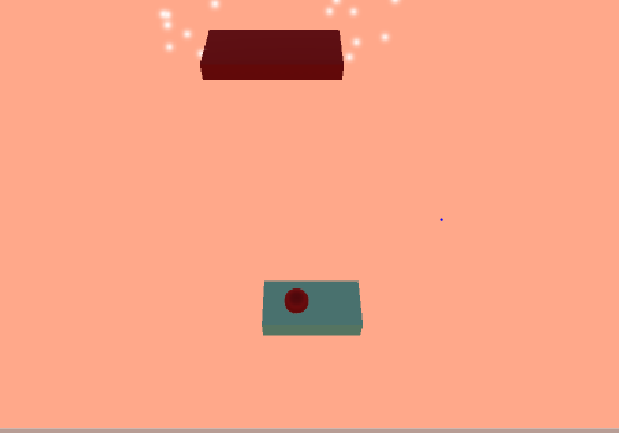

# spherePlatformer
played around with 3d models, physics and colliders, made a simple spherePlatformer

HOW TO PLAY :

1. Download zip folder or use git clone <repo>
2. open the project in unity 
3. goto -> project (window) -> assets (folder) -> SampleScene (double click to load)
4. play the SampleScene, window will go full screen

W,A,S,D to move around the player sphere. press SPACE to jump (it has a refresh so be patient when chanign platforms)

Gameplay screenshots

